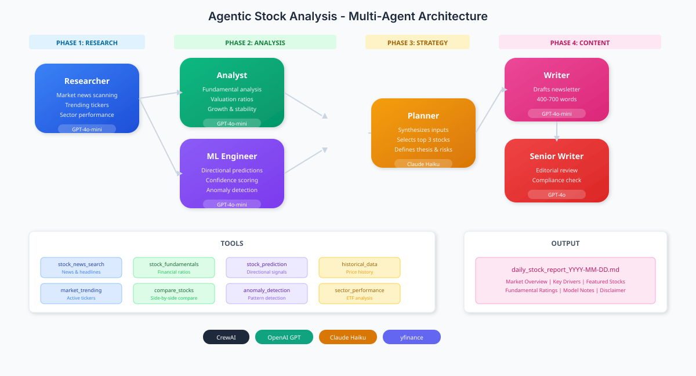

# 📈 Autonomous Multi-Agent Stock Research System

An AI-powered stock research orchestrator built with [CrewAI](https://crewai.com) that coordinates specialized agents to produce daily, research-driven stock reports.

## 🎯 Mission

Every trading day, discover, analyze, and summarize stocks with interesting risk/reward profiles by combining:
- Real-time market news and sentiment
- Fundamental analysis (valuation, profitability, growth)
- Quantitative signals (ML-based directional predictions)
- Clear written commentary and risk disclosures

> **⚠️ DISCLAIMER**: This system generates informational analysis only. It does NOT provide personalized investment advice or specific trading instructions.

---

## 🏗️ System Architecture

<div align="center">
  
</div>

<details>
<summary>View ASCII Architecture</summary>

```
╔══════════════════════════════════════════════════════════════════════════════════════════╗
║                                                                                          ║
║                          AUTONOMOUS STOCK RESEARCH SYSTEM                                ║
║                                                                                          ║
╠══════════════════════════════════════════════════════════════════════════════════════════╣
║                                                                                          ║
║    ┏━━━━━━━━━━━━━━━━━━━━━━━━━━━━━━━━━━━━━━━━━━━━━━━━━━━━━━━━━━━━━━━━━━━━━━━━━━━━━━━━┓    ║
║    ┃                           PHASE 1: DATA COLLECTION                             ┃    ║
║    ┗━━━━━━━━━━━━━━━━━━━━━━━━━━━━━━━━━━━━━━━━━━━━━━━━━━━━━━━━━━━━━━━━━━━━━━━━━━━━━━━━┛    ║
║                                                                                          ║
║         ╔═══════════════════════════════════════════════════════════════╗                ║
║         ║                                                               ║                ║
║         ║     🔍  R E S E A R C H E R                                   ║                ║
║         ║         ─────────────────────                                 ║                ║
║         ║         • Scans market news & headlines                       ║                ║
║         ║         • Identifies trending tickers                         ║                ║
║         ║         • Tracks sector performance                           ║                ║
║         ║                                                               ║                ║
║         ║     Tools: stock_news_search | market_trending_tickers        ║                ║
║         ║            sector_performance | SerperDevTool                 ║                ║
║         ║                                                               ║                ║
║         ╚═══════════════════════════════════════════════════════════════╝                ║
║                                          │                                               ║
║                                          ▼                                               ║
║    ┏━━━━━━━━━━━━━━━━━━━━━━━━━━━━━━━━━━━━━━━━━━━━━━━━━━━━━━━━━━━━━━━━━━━━━━━━━━━━━━━━┓    ║
║    ┃                           PHASE 2: DEEP ANALYSIS                               ┃    ║
║    ┗━━━━━━━━━━━━━━━━━━━━━━━━━━━━━━━━━━━━━━━━━━━━━━━━━━━━━━━━━━━━━━━━━━━━━━━━━━━━━━━━┛    ║
║                                                                                          ║
║    ╔════════════════════════════════╗    ╔════════════════════════════════╗              ║
║    ║                                ║    ║                                ║              ║
║    ║  📊  A N A L Y S T             ║    ║  🤖  M L   E N G I N E E R     ║              ║
║    ║      ─────────────             ║    ║      ───────────────────       ║              ║
║    ║  • Fundamental analysis        ║    ║  • Directional predictions     ║              ║
║    ║  • Valuation ratios (P/E,ROE)  ║    ║  • Confidence scoring          ║              ║
║    ║  • Growth & stability ratings  ║    ║  • Anomaly detection           ║              ║
║    ║                                ║    ║                                ║              ║
║    ║  Tools: stock_fundamentals     ║    ║  Tools: stock_prediction       ║              ║
║    ║         compare_stocks         ║    ║         batch_stock_predictions║              ║
║    ║         stock_historical_data  ║    ║         anomaly_detection      ║              ║
║    ║                                ║    ║                                ║              ║
║    ╚════════════════════════════════╝    ╚════════════════════════════════╝              ║
║                       │                              │                                   ║
║                       └──────────────┬───────────────┘                                   ║
║                                      ▼                                                   ║
║    ┏━━━━━━━━━━━━━━━━━━━━━━━━━━━━━━━━━━━━━━━━━━━━━━━━━━━━━━━━━━━━━━━━━━━━━━━━━━━━━━━━┓    ║
║    ┃                           PHASE 3: STRATEGY                                    ┃    ║
║    ┗━━━━━━━━━━━━━━━━━━━━━━━━━━━━━━━━━━━━━━━━━━━━━━━━━━━━━━━━━━━━━━━━━━━━━━━━━━━━━━━━┛    ║
║                                                                                          ║
║         ╔═══════════════════════════════════════════════════════════════╗                ║
║         ║                                                               ║                ║
║         ║     🎯  P L A N N E R                                         ║                ║
║         ║         ─────────────                                         ║                ║
║         ║         • Synthesizes all inputs                              ║                ║
║         ║         • Selects 3 focal stock ideas                         ║                ║
║         ║         • Defines thesis + time horizon + risks               ║                ║
║         ║                                                               ║                ║
║         ║     LLM: Claude 3 Haiku (Strategic Reasoning)                 ║                ║
║         ║                                                               ║                ║
║         ╚═══════════════════════════════════════════════════════════════╝                ║
║                                          │                                               ║
║                                          ▼                                               ║
║    ┏━━━━━━━━━━━━━━━━━━━━━━━━━━━━━━━━━━━━━━━━━━━━━━━━━━━━━━━━━━━━━━━━━━━━━━━━━━━━━━━━┓    ║
║    ┃                           PHASE 4: CONTENT CREATION                            ┃    ║
║    ┗━━━━━━━━━━━━━━━━━━━━━━━━━━━━━━━━━━━━━━━━━━━━━━━━━━━━━━━━━━━━━━━━━━━━━━━━━━━━━━━━┛    ║
║                                                                                          ║
║    ╔════════════════════════════════╗    ╔════════════════════════════════╗              ║
║    ║                                ║    ║                                ║              ║
║    ║  ✍️   W R I T E R              ║───▶║  📝  S E N I O R   W R I T E R ║              ║
║    ║       ───────────              ║    ║      ─────────────────────     ║              ║
║    ║  • Drafts newsletter           ║    ║  • Editorial review            ║              ║
║    ║  • Structures content          ║    ║  • Compliance check            ║              ║
║    ║  • 400-700 words               ║    ║  • Quality assurance           ║              ║
║    ║                                ║    ║                                ║              ║
║    ║  LLM: GPT-4o-mini              ║    ║  LLM: GPT-4o (Premium)         ║              ║
║    ║                                ║    ║                                ║              ║
║    ╚════════════════════════════════╝    ╚════════════════════════════════╝              ║
║                                                     │                                    ║
║                                                     ▼                                    ║
║    ┏━━━━━━━━━━━━━━━━━━━━━━━━━━━━━━━━━━━━━━━━━━━━━━━━━━━━━━━━━━━━━━━━━━━━━━━━━━━━━━━━┓    ║
║    ┃                              📄  OUTPUT                                        ┃    ║
║    ┣━━━━━━━━━━━━━━━━━━━━━━━━━━━━━━━━━━━━━━━━━━━━━━━━━━━━━━━━━━━━━━━━━━━━━━━━━━━━━━━━┫    ║
║    ┃                                                                                ┃    ║
║    ┃     📁  reports/daily_stock_report_YYYY-MM-DD.md                               ┃    ║
║    ┃                                                                                ┃    ║
║    ┃     Contents:                                                                  ┃    ║
║    ┃     ├── Market Overview                                                        ┃    ║
║    ┃     ├── Key Drivers (5 news items)                                             ┃    ║
║    ┃     ├── Featured Stocks (3 picks with thesis)                                  ┃    ║
║    ┃     ├── Fundamental Ratings Table                                              ┃    ║
║    ┃     ├── Model & Risk Notes                                                     ┃    ║
║    ┃     └── Disclaimer                                                             ┃    ║
║    ┃                                                                                ┃    ║
║    ┗━━━━━━━━━━━━━━━━━━━━━━━━━━━━━━━━━━━━━━━━━━━━━━━━━━━━━━━━━━━━━━━━━━━━━━━━━━━━━━━━┛    ║
║                                                                                          ║
╚══════════════════════════════════════════════════════════════════════════════════════════╝
```

</details>

---

## 🤖 Agent Team

| Agent | Role | LLM | Outputs |
|-------|------|-----|---------|
| **Researcher** | Equity & Market News Researcher | GPT-4o-mini | Curated news, trending tickers, market themes |
| **Analyst** | Fundamental & Technical Analyst | GPT-4o-mini | Financial ratios, value/growth/stability ratings |
| **ML Engineer** | Quantitative Signals Engineer | GPT-4o-mini | Directional signals, confidence scores, anomaly flags |
| **Planner** | Investment Strategy Planner | Claude 3 Haiku | Daily stock plan with thesis, horizons, risks |
| **Writer** | Daily Brief Writer | GPT-4o-mini | Draft Markdown newsletter |
| **Senior Writer** | Editorial Lead & Quality Gate | GPT-4o | Final polished, compliant report |

---

## 🛠️ Tools Available

### 📰 News & Research
| Tool | Description |
|------|-------------|
| `stock_news_search` | Search stock-specific news and headlines |
| `market_trending_tickers` | Get trending and most active stocks |
| `sector_performance` | Analyze sector ETF performance |

### 📊 Fundamental Analysis
| Tool | Description |
|------|-------------|
| `stock_fundamentals` | Comprehensive financial ratios and metrics |
| `compare_stocks` | Side-by-side comparison of multiple stocks |
| `stock_historical_data` | Price history with technical indicators |

### 🤖 ML & Prediction
| Tool | Description |
|------|-------------|
| `stock_prediction` | Rules-based directional signal generation |
| `batch_stock_predictions` | Predictions for multiple stocks |
| `anomaly_detection` | Detect unusual patterns in stock behavior |

---

## 🚀 Installation

Ensure you have Python >=3.10 <3.14 installed. This project uses [UV](https://docs.astral.sh/uv/) for dependency management.

```bash
# Install UV if not already installed
pip install uv

# Navigate to project directory and install dependencies
crewai install
```

---

## ⚙️ Configuration

### 1. Set up API keys in your `.env` file:

```env
OPENAI_API_KEY=your_openai_api_key
ANTHROPIC_API_KEY=your_anthropic_api_key  # For Claude models
SERPER_API_KEY=your_serper_api_key        # For web search
```

### 2. Customize LLMs per agent in `crew.py`:

```python
# Default LLM (fast & cost-effective)
default_llm = LLM(model="gpt-4o-mini", temperature=0.7)

# Premium LLM for strategic reasoning
planner_llm = LLM(model="anthropic/claude-3-haiku-20240307", temperature=0.5)

# Editorial LLM for quality output
senior_writer_llm = LLM(model="gpt-4o", temperature=0.3)
```

### 3. Customize agents & tasks:
- `src/agentic_stock_analysis/config/agents.yaml`
- `src/agentic_stock_analysis/config/tasks.yaml`

---

## 📋 Running the System

### Run Daily Stock Research
```bash
crewai run
```
Generates report in `reports/daily_stock_report_YYYY-MM-DD.md`

### Run Focused Analysis
```bash
run_focused AAPL,MSFT,GOOGL
```

### Other Commands
```bash
train <n_iterations> <output_filename>   # Train the crew
replay <task_id>                         # Replay from a task
test <n_iterations> <eval_llm>           # Test execution
```

---

## 📁 Project Structure

```
agentic_stock_analysis/
├── src/agentic_stock_analysis/
│   ├── config/
│   │   ├── agents.yaml           # Agent definitions
│   │   └── tasks.yaml            # Task definitions
│   ├── tools/
│   │   ├── stock_news_search_tool.py
│   │   ├── stock_fundamentals_tool.py
│   │   └── stock_prediction_tool.py
│   ├── crew.py                   # Crew orchestration + LLM config
│   └── main.py                   # Entry points
├── reports/                      # Generated daily reports
├── knowledge/                    # Knowledge base
├── pyproject.toml
└── README.md
```

---

## 🔒 Safety & Compliance

| Principle | Implementation |
|-----------|----------------|
| **No personalized advice** | All outputs are general informational analysis |
| **Clear disclaimers** | Every report includes visible disclaimers |
| **Factual separation** | Clear distinction between facts, analysis, and model outputs |
| **Risk disclosure** | Key risks and uncertainties explicitly acknowledged |
| **No guarantees** | No promises of future performance; emphasizes uncertainty |

---
